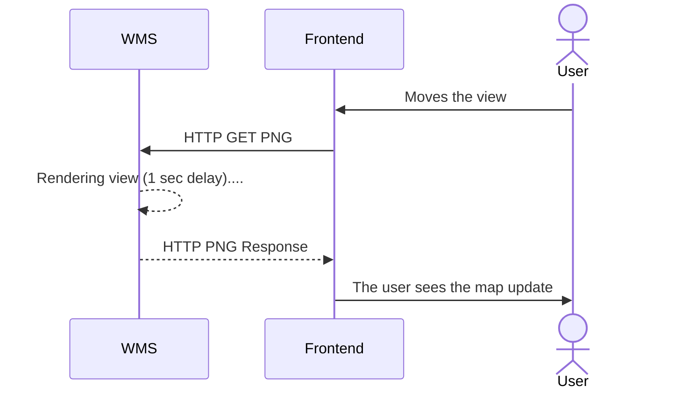
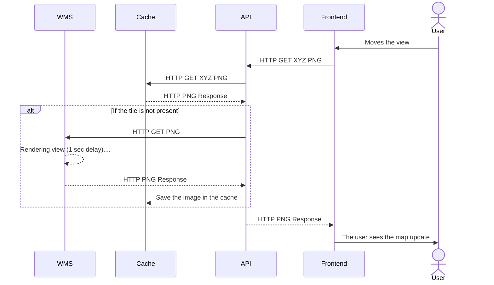

import HarViewer from "@/components/posts/catastro/HarViewer.astro"

Like any good 20-something, I like to live life and have my little splurges:
getting a good job, moving out, saving for retirement, and buying a home.
Fortunately, most of these goals are well on track, but buying a home is
proving elusive. Sometimes I get frustrated with it because I feel I'm not
doing enough to achieve it, but then I look at interest rates and it passes.

In all my adventures and misadventures in the search for a property I can
afford, there is one constant: the sea of tears involved in looking up
cadastral information. An afternoon of property hunting usually looks like this:

1. Doing doomscrolling through a myriad of ads that don't fit my needs<text class="joke">(a.k.a. I'd have to sell my soul to the devil)</text>
2. Finding a property that might work for me
3. Checking the information against the cadastre, especially for land plots<text class="joke">(Yes, I value self-building. Am I crazy? I know)</text>.
Normally there is no cadastral reference provided, and you have to ~~suffer~~ use the map on the website
4. Go back to point 1

"But Juan, why do you look all this up in the cadastre if it's usually detailed in the ad?" Once I reported an ad for listing a
plot of land as urban when the cadastral information for the land (provided in the ad) listed it as rustic.
They proceeded to remove the cadastral information from the ad instead of listing it correctly. You can't trust anyone nowadays,
especially with something that can mortgage you<text class="joke">(pun intended)</text> for life.

#### User experience 

I present to you the [Spanish Cadastre map](https://www1.sedecatastro.gob.es/cartografia/mapa.aspx). At first glance, it may seem like the map is responsive. I invite the reader to zoom in until the cadastral information starts to appear:


As soon as you move the map, you can see a loading symbol. This repeats if you want to change the view which, honestly, is quite annoying.
If we compare it with the user experience of Google Maps, it leaves much to be desired :cry::
<iframe src="https://www.google.com/maps/embed?pb=!1m14!1m12!1m3!1d10320.778665109237!2d-3.8255837034881357!3d43.45703729569251!2m3!1f0!2f0!3f0!3m2!1i1024!2i768!4f13.1!5e0!3m2!1sen!2ses!4v1708292145491!5m2!1sen!2ses" width="100%" height="600" style="border:0;" allowfullscreen="" loading="lazy" referrerpolicy="no-referrer-when-downgrade"/>


#### How does the cadastre work?

By occupational defect, seeing a computer system not working properly catches my attention and, if I have to use it frequently, I need to try
to fix it <text class="joke">(even if my GitHub history suggests otherwise :sweat_smile:)</text>.
As it is an external service, it is quite complicated to fix, but sometimes you can try to mitigate the issues. There's no harm in trying, right?


##### HTTP Requests

As a backender, my first instinct is to go to what I know: API requests:
<HarViewer/>

As can be observed, several requests are used to render the map:
1. Images taken from [tms-ign-base.idee.es](http://idee.es) which are quite efficient :+1:
2. Images taken from [sedecatastro.gob.es](https://www.sedecatastro.gob.es) which are not :-1:

The fact that a map image has a latency of almost 1 second is not a good omen. Let's take a look at several of the request parameters:

```
SERVICE=WMS
WIDTH=1920
HEIGHT=425
BBOX=-434969.6867710633,5381250.394276095,-425797.2433768422,5383280.75283992
```

There are several things to highlight in these parameters:
- The WIDTH and HEIGHT parameters clearly show a request for an image the size of the browser.
This contrasts with the way Google Maps or [tms-ign-base.idee.es](http://idee.es) queries, as they receive several images per render.
- BBOX, being a continuous rather than discrete range, suggests that the server performs the rendering at the time of the request. The way the rest of the requests are made, being discrete and following a directory structure, points to a content server that simply serves stored files.
- The SERVICE parameter points to a protocol or backend server specification. We'll come back to this later.

The main conclusion that can be drawn from this analysis is that the request interface is not very cache friendly. Every time the map view is moved, the entire image needs to be 
re-rendered. Furthermore, images outside the viewport cannot be pre-rendered as in tiling-based maps. These factors make the user experience 
very clumsy.


##### Can we fix it on the client side?

The hypothesis of the previous section suggests that the requests are not very optimized. It might seem at first glance that we can't do anything about it, but... turns out we 
can!.

Let me introduce you to [Leaflet.js](https://leafletjs.com/), a library for integrating interactive maps using different servers. While reading the documentation of the library to integrate the [idee.es](http://idee.es) view, I discovered something called [TileLayer.WMS](https://leafletjs.com/reference.html#tilelayer-wms). Does that ring a bell? Exactly. It's the SERVICE parameter of the request. This suggests that the backend uses a defined standard and probably some open-source software to serve the information.

Let's try to create a small JS component to render the cadastre information:

```javascript
var map = L.map('map').setView([43.454, -3.823], 18);
var IGN = L.tileLayer('https://tms-ign-base.idee.es/1.0.0/IGNBaseTodo/{z}/{x}/{-y}.jpeg', {maxZoom: 17});
IGN.addTo(map);
var ortofoto = L.tileLayer('https://tms-pnoa-ma.idee.es/1.0.0/pnoa-ma/{z}/{x}/{-y}.jpeg');
ortofoto.addTo(map);
var catastro = L.tileLayer.wms("https://www1.sedecatastro.gob.es/cartografia/GeneraMapa.aspx", {
    layers: 'CATASTRO',
    format: 'image/png',
    transparent: true
});
var baseMaps = {
    "IGN": IGN,
    "Ortofoto": ortofoto
};
var overlayMaps = {
    "Catastro": catastro
}
var layerControl = L.control.layers(baseMaps, overlayMaps).addTo(map);
```

Here is the map prototype that allows rendering both the satellite map and the cadastral information.
On the top right, you can toggle the different layers. If you try zooming in and activating the cadastre 
layer, you can see a great improvement in performance.

> :warning: 
> The cadastre server has rate limits on the number of requests. Since the client uses a tiling process, it makes many more requests than 
> usual and can trigger the rate limit. I do not recommend using this solution for a long time (it is here for illustrative purposes) 
> and I definitely don't say this from personal experience :innocent: 

<embed src="/static/posts/mapa-catastro/componente/index.html" style="width:100%; height: 800px;"/> 

#### The root of the problem

Bingo. So a very simple client can be created that runs smoothly with the backend. Then... Why is the web experience so dire?

The JavaScript code for rendering the cadastre map can be accessed through [this link](https://www1.sedecatastro.gob.es/Cartografia/js/mapa.js). 
One of the important things it refers to is a library called [OpenLayers](https://openlayers.org/). This library is, in essence, an alternative to LeafLet for visualizing maps.

Let's see how it uses this library:

```javascript
771 var vectorLayer = new ol.layer.Vector({ title: 'Posicionar', source: vectorSource });

777 var map = new ol.Map({
778    interactions: interaccionesxDefecto,
779    controls: ([pantallaCompleta, rotor, EscalaLineal, PosicionRatonGPS]),
780    target: 'map',
782    layers: [vectorLayer],
783    moveTolerance: 5,
784    view: vistaMapa
785 });
```

As you can see, currently the cadastre makes inefficient use of the library by using a vector layer. 
As we saw before, it requests cadastral information with a single request for everything that needs to be rendered at that moment.

If we substitute the map definition with:
```javascript
779 var map = new ol.Map({
780    interactions: interaccionesxDefecto,
781    controls: ([pantallaCompleta, rotor, EscalaLineal, PosicionRatonGPS]),
782    target: 'map',
783    layers: [layerIGNT, layerTeseladaTamanio, layerTeselada],
784    moveTolerance: 5,
785    view: vistaMapa
786 });
```
and activate the layer in the program loop:

```diff
    if (ponerCAT && ponerCATEscala) {
-        map.addLayer(layer1Imagen);
+        map.addLayer(layerTeselada);
    }
    if (ponerGeoServerWMSR) {
        map.addLayer(layerGeoserverWMSR);
    };
    if (ponerGeoServerWMTSR) {
        map.addLayer(layerGeoserverWMTSR);
    };
    if (soloTematicos) {
        if (ponerTematicos) {
-            map.removeLayer(layer1Imagen);
+            map.removeLayer(layerTeselada);
            map.addLayer(layer1Tematicos);
        };
    }
```
We achieve that the client gets the map in a tiled way :tada::tada::tada:

<text class="joke">Did you expect a modified version of the cadastre website embedded to demonstrate it? Me too. Unfortunately, the counter of days without CORS problems has returned to zero</text>


##### But wouldn't tiling bombard the server with requests?

Yes and no. Effectively, with the current server infrastructure, needing to render every image returned by the tiling 
could cause a denial of service <text class="joke">(although it could be argued whether it is beneficial that it is inherently parallelizable and compressing smaller images, especially being PNG)</text>. In fact, it is quite likely that the JavaScript has disabled tiling due to overload and request limit issues.


<center>Current Implementation</center>



However, if the tiling used an [XYZ](https://openlayers.org/en/latest/examples/xyz.html) protocol like Google or IDEE does, it would be easily convertible into a content delivery problem, which is inherently less costly:


<center>Proposed Implementation</center>



With this solution, the cadastre website could have the fluidity we achieved in the Javascript example without incurring a computational overhead by launching several simultaneous renderings. Furthermore, a change in the backend or the infrastructure with which the data is uploaded and updated would not be necessary.

In fact, simply invalidating the cache when an update of the data for that region occurs would be enough to have updated data.


#### Next steps

After this analysis and without involving the cadastre, one could try to set up an optimized visualization server with the open data from the cadastre. However, the [bulk dump](https://www.catastro.hacienda.gob.es/webinspire/index.html) of the cadastre data is updated twice a year and, without obtaining real-time updates, the map would quickly become outdated.

Another option would be to set up the cache on top of the public API of the WMS server. It would be the most viable option since it would allow obtaining real-time updates simply 
by invalidating the cache. However, the public API of the cadastre has rate_limits<text class="joke">(for obvious and justified reasons)</text> which would block the server
with minimal traffic.

So, for now, this mini project goes into the drawer of paused projects waiting for some charitable soul to use this post to fix the UX of the website.


